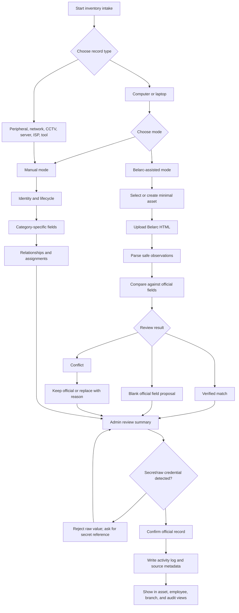

# Inventory Intake - Manual Mode and Belarc-Assisted Flow

> Proposed route family: `/inventory/intake`, `/inventory/intake/new`, `/inventory/intake/[draftId]`, and review surfaces inside `/hardware-audit`.
> Status: Local implementation candidates recorded 2026-08-23; not yet migrated, committed as focused changes, browser/staging verified, or deployed. See [[Journal/2026-08-23]].
> Phase 1 implementation target: [[Planning/Phase-1-Computer-Intake-Spec]]
> Task status tracked in [[Planning/Pages/_Overview#Inventory-Intake]]

Manual Mode is the official primary path for adding inventory because it covers employees, computers, peripherals, network equipment, CCTV/NVR, ISP circuits, and tools. Belarc assists only computer/laptop/server-like hardware evidence and must go through review before official values change.

## Intake Entry

The first screen asks for record type:

| Type | Mode |
|---|---|
| Computer or laptop | Manual or Belarc-assisted |
| Peripheral or equipment | Manual only |
| Network device | Manual only |
| CCTV camera or NVR | Manual only |
| Server | Manual first; Belarc evidence optional only if supported |
| ISP circuit | Manual only |
| Tool or stock | Manual only |

## Manual Wizard

| Step | Purpose | Fields |
|---|---|---|
| Identity | Create the official record shell | Name, category, branch, serial, property tag, owner/custodian |
| Lifecycle | Place it in operations | Status, condition, ownership, purchase/warranty dates, notes |
| Category details | Show only relevant fields | Computer specs, CCTV location/NVR channel, switch port map, ISP circuit, tool quantity |
| Relationships | Connect the record | Employee assignment, parent asset, network port, NVR channel, branch |
| Review | Confirm official source | Summary of entered fields, sensitivity warnings, missing required fields |

## Belarc-Assisted Computer Flow

Belarc-assisted mode starts from an existing or minimal Asset record, then uploads a Belarc HTML scan. The parsed result becomes evidence. Admin chooses which safe fields to accept.

| Comparison result | Behavior |
|---|---|
| Official value is blank and Belarc has selected value | Proposed fill; admin must accept |
| Official value equals Belarc value | Mark verified |
| Official value differs from Belarc value | Blocking conflict until admin chooses keep official or replace with reason |
| Belarc field is volatile or unsafe | Store as observation or ignore; never official |

## Flowchart

## UX Rules

- Use a step-based form; do not create one huge all-field screen.
- Show only fields relevant to the selected record type.
- Keep counts as summaries, not editable official fields, once child records exist.
- Put source labels beside sensitive or audit-relevant values: Manual, Belarc, Existing, Conflict.
- Keep copy short and operational: field labels, helper text for uncommon fields, and precise validation errors.
- Let users save drafts because infrastructure records can be incomplete during site walkthroughs.
- Do not show raw secrets; show only secret-reference metadata to authorized users.

## Page Impact

| Existing page | Change planned |
|---|---|
| [[Planning/Pages/Assets]] | Add category-specific sections for specs, connectivity, relationships, audit/source confidence |
| [[Planning/Pages/Employees]] | Show assigned devices, BYOD/company ownership, and identity/department linkage |
| [[Planning/Pages/Branches]] | Show infrastructure, CCTV, ISP, and computed counts per branch |
| [[Planning/Pages/HardwareAudit]] | Reposition Belarc as assisted evidence for computer fields, not a universal inventory source |
| [[Planning/Pages/Roles]] | Add permission concepts for intake, Belarc review, infrastructure edit, and secret-reference edit |

## Implementation Phases

| Phase | Scope |
|---|---|
| 1 | Company computer/laptop Manual Mode, `DeviceProfile`, `AssetComponent`, optional assignment, source labels, and production-gated Belarc proposals. See [[Planning/Phase-1-Computer-Intake-Spec]]. |
| 2 | Belarc proposal hardening after licensing: conflict queue, raw evidence policy, source retention, and baseline separation |
| 3 | Network interfaces, IP/VLAN/port records, branch connectivity views |
| 4 | CCTV/NVR camera-channel mapping and location display |
| 5 | Server roles, firewall, domain/file server profiles, ISP circuits |
| 6 | Tools/stock quantity mode and serialized equipment split |

[[Home]] | [[Planning/Inventory-Field-Dictionary]] | [[Planning/Phase-1-Computer-Intake-Spec]] | [[Decisions/2026-08-22-manual-primary-belarc-assisted-intake]]
